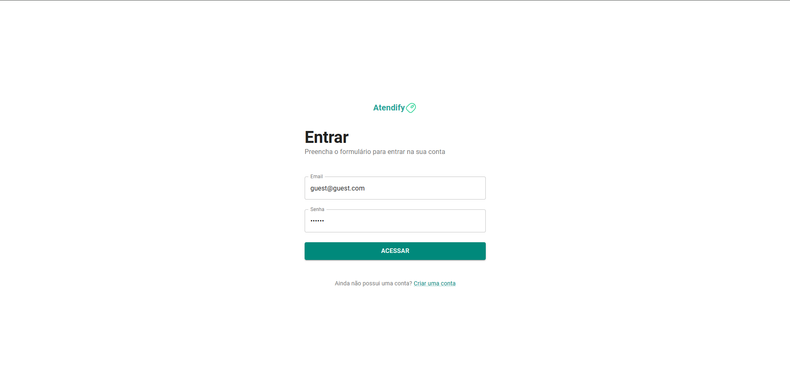

<h1 align="center" style="font-weight: bold;">Atendify</h1>

<p align="center">
 <a href="#tech">Tecnologias</a> • 
 <a href="#started">Primeiros Passos</a>
 
</p>

<p align="center">
    <b>Desenvolvimento de uma plataforma de gestão de chamados</b>
</p>


<h2 id="layout">🎨 Layout</h2>

<p align="center">
    
    <!-- category screens -->
    
    <!-- customer screens -->
    
    <!-- order screens -->
    

</p>

<h2 id="apresentation">🎥 Vídeo de apresentação</h2>

https://github.com/user-attachments/assets/9fc6a0a1-d9bc-4ea7-8971-97d867c66224


<h2 id="technologies">💻 Tecnologias</h2>

- React
- TypeScript
- Material UI
- Styled-Components

<h2 id="started">🚀 Primeiros passos</h2>

<h3>Pré-requisitos</h3>

- [Node.js](https://nodejs.org)
- [Git](https://git-scm.com/)

<h3>⚠️ Atenção</h3>

Lembre-se o projeto back-end deve estar sendo executado junto do front-end, saiba como executar o projeto Back-end:

```http
https://github.com/reisArthur2602/api-gestao-chamados
```

<h3>Clone o projeto</h3>

```bash
git clone https://github.com/reisArthur2602/atendify
```

<h3>Configure as váriaveis .env </h2>

Use o `.env.example` como referência para criar seu arquivo de configuração `.env`

```yaml
VITE_API_URL=
```

<h3>Rodar o Projeto</h3>

```bash
cd nome-do-projeto
npm install
npm run dev
```
